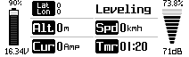
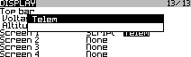

# opentx-telemetry
**[OpenTX](http://www.Open-TX.org) Telemetry Script for Taranis X9D Plus
with X-Series Receiver**

Based on [_olimetry.lua_](http://YouTu.be/dMNDhq2QJv4) by Ollicious (bowdown@gmx.net)

## About
This is a simplified and stripped-down variant of the _olimetry.lua_ script
by Ollicious. It does not offer the same degree of customizability, as it
only provides a subset of the original widgets.

## Features
* Automatic Flight Mode detection for [dRonin](http://dRonin.org)
* Automatic detection of 1S, 2S, 3S, 4S, 6S or 8S LiPo, but not 5S nor 7S
* Automatic selection of voltage sorce among FrSky **FLVSS**, **Cels** or **VFAS**
* Automatic selection between Crossfire **RQly** or **RSSI** 
  

## Usage
* edit constants in the `settings` section to meet your needs
* copy _/IMAGES/_ and _/SCRIPTS/_ folders to the same folders on the Taranis
  SD card
* select Script _Telem_ for one of the Screens on the Display page of your
  OpenTX model
  

## Contributing
Pull requests for improvements on this basic functionality are always welcome.

## License
This work is published under the terms of the MIT License, see file `LICENSE`.
