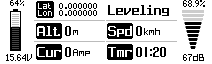

# OpenTX-Telemetry
**[OpenTX](http://www.open-tx.org) Telemetry Script for Taranis X9D Plus 
[Eagletree Vector Open Telemetry (Serial 57600 baud) -> TBS BST (Blacksheep telemetry)](https://github.com/pkurucz/opentelem_to_bst_bridge)**

Based on [yds/opentx-telemetry](https://github.com/yds/opentx-telemetry/tree/dRonin) 
for dRonin by YDS

## About
This script is customized to work with the Eagletree Vector Flight controller.

Initial hardware support for TBS crossfire via: [opentelem_to_bst_bridge](https://github.com/pkurucz/opentelem_to_bst_bridge).

Follow-on support for Dragonlink to be added. (Stay tuned)

## Features
* Automatic Flight Mode detection from and voice callouts
* Automatic detection of **1S**, **2S**, **3S**, **4S**, **6S** or **8S**
  _LiPo_ or _LiHV_, but not **5S** nor **7S**
* Automatic selection of voltage source among _FrSky_ `FLVSS`, `Cels` or `VFAS`
* Automatic voice callouts of Voltage every 10% and below minimum
* Automatic voice callouts of Current Amps over maximum
* `No Telemetry` dispalys the lowest battery `Voltage` or the highest values
  for `Current`, `Speed`, `Altitude` and the last recorded `GPS`
  `Lattitude` and `Longitude` from the previous flight
* Automatic reset when `Telemetry` connects

> 

## Taranis Usage
* edit constants in the `settings` section to meet your needs
* copy `/SCRIPTS/TELEMETRY/Telem.lua` to the Taranis SD card
* select _Script_ **Telem** for one of the _Screens_ on the _Display_ page of your
  _OpenTX model_

> 

## Contributing
Pull requests for improvements on basic functionality are always welcome.

## License
This work is published under the terms of the MIT License, see file `LICENSE`.
